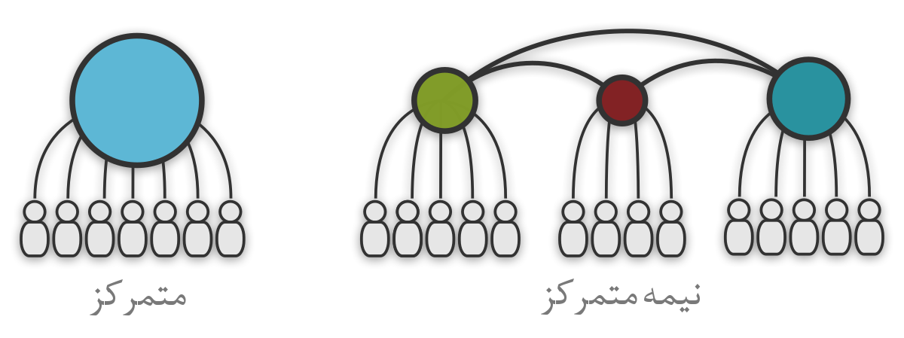
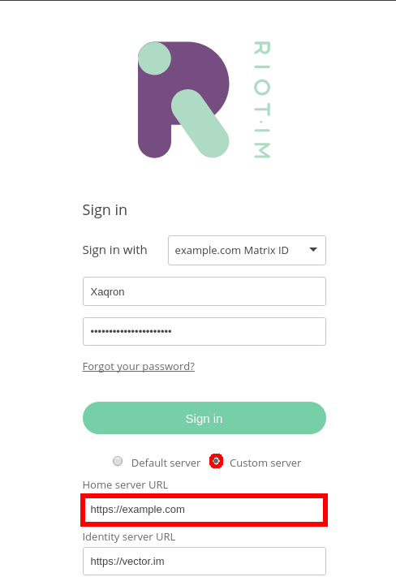
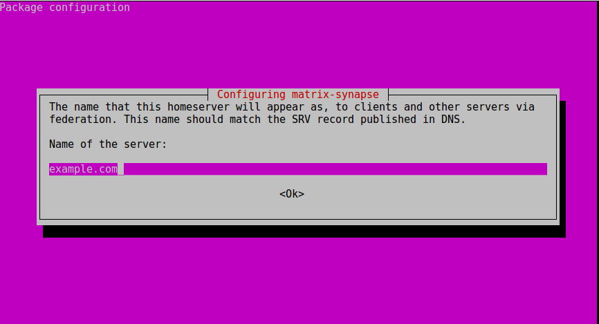

<h1 dir="rtl">
# سیناپس
</h1>
<h2 dir="rtl">
دستورالعمل راه اندازی سرور سیناپس برای پیامرسان های مبتنی بر پروتکل ماتریکس.
</h2>

اگر قصد راه اندازی سرور سیناپس را ندارید و صرفا به دنبال پیامرسانی امن با امکانات بالا می گردید توصیه می شود <a href="https://riot.im/">رایوت</a> را نصب کنید و ادامه ی این آموزش برای شما مناسب نمی باشد.
استفاده از این آموزش مستلزم دانش متوسط از سرورهای لینوکس و تنظیمات مرتبط با دامنه می باشد.

پیامرسانهای متنوعی بر اساس پروتکل <a href="https://matrix.org/blog/home/">ماتریکس</a> ساخته شده اند که لیستی از آنها را در <a href="https://matrix.org/docs/projects/try-matrix-now.html">اینجا</a> می توانید مشاهده کنید.
این پروتکل بر اساس بلاک چین بوده و پیامرسانهای مبتنی بر آن غیرمتمرکز می باشند. بدین معنی که تعدادی کاربر به یک سرور متصل می شوند و قادر به تبادل پیام خواهند بود. در صورتی که این سرور به سرور های دیگری متصل باشد امکان ارتباط بین کاربران آنها فراهم خواهد شد.

اکثر سرویسهای امروزی به صورت متمرکز طراحی شده اند یعنی کنترل تمامی سیستم در اختیار شخصیتی حقوقی قرار دارد. نظیر پیامرسان تلگرام، سرویس توییتر و یا فیسبوک. در شکل زیر در سمت چپ مدل متمرکز و در سمت راست مدل نیمه متمرکز را ملاحظه می فرمایید. پیامرسانهای مبتنی بر پروتکل ماتریکس مطابق مدل سمت راست می باشند. دقت کنید تفاوت این نوع از طراحی در عدم کنترل یک شخصیت حقوقی واحد بر مجموعه ها می باشد و نه صرفا آرایش فیزیکی زیرا در عمل سرویسهای متمرکز هم با استفاده از CDN ها بار را توزیع می نمایند.

هدف از این آموزش راه اندازی یکی از سرورهای سمت راست نظیر دایره ی قرمز (دایره ی وسط) در بخش نیمه متمرکز» می باشد.
بدین صورت شما و دوستانتان قادر خواهید بود با ارتباطی امن به تبادل پیام بپردازید. در صورتی که سرور خود را به سایر سرورهای مبتنی بر پروتکل ماتریکس متصل نمایید امکان ارتباط بین کاربران شما و کاربران آن سرورها به وجود خواهد آمد.

مزیت این مدل ارتباطی این است که حتی بر روی اینترنت ملی نیز پیامرسان شما قادر به ارائه سرویس خواهد بود ضمن اینکه همیشه اطلاعات شما در اختیار خودتان خواهد بود.
شما کماکان قادر به استفاده از انواع پیامرسان های سازگار با پروتکل ماتریکس نظیر <a href="https://riot.im/">رایوت</a> خواهید بود با این تفاوت که به جای سرور پیش فرض می توانید به سرور خود متصل شوید. نظیر شکل زیر:

<h2 dir="rtl">
دستورالعمل راه اندازی سرور سیناپس
</h2>

<h3 dir="rtl">
- توجه: در تمامی مراحل این آموزش example.com باید با دامنه خود شما جایگزین گردد.
</h3>

این دستورالعمل برای سرورهای مبتنی بر دبیان (debian) می باشد هر چند برای سایر سرورهای لینوکسی هم کمابیش قابل استفاده می باشد.

ابتدا از آپدیت بودن سرور اطمینان حاصل نمایید:

<code>$ sudo apt update</code>

<code>$ sudo apt full-upgrade -y</code>

<code>$ sudo apt autoremove</code>

<code>$ sudo apt autoclean</code>

nginx را نصب نمایید:

<code>$ sudo apt install nginx -y</code>

مخزن سیناپس و کلید آنرا اضافه کنید:

<code>$ sudo add-apt-repository https://matrix.org/packages/debian/</code>

<code>$ wget -qO - https://matrix.org/packages/debian/repo-key.asc | sudo apt-key add -</code>

سیستم عامل را آپدیت و سیناپس را نصب نمایید:

<code>$ sudo apt-get update</code>

<code>$ sudo apt-get install matrix-synapse</code>

در هنگام نصب تصویری نظیر شکل زیر خواهید دید که از شما نام دامنه مورد نظرتان را خواهد پرسید و اینکه آیا مایل به ارسال آمار سرور خود به صورت ناشناس به سایت سیناپس هستید یا خیر. اگر دامنه ی شما example.com می باشد نظیر تصویر زیر در پنجره ی مربوطه آنرا وارد کنید (یا هر دامنه ی دیگر)

توجه داشته باشید که شما باید پیش از این یک رکورد دی ان اس منطبق با آی پی سرور خود و دامنه تان در دی ان اس سرور تان ثبت کرده باشید.

DNS: A Record for example.com => x.x.x.x

مثلا x.x.x.x می تواند 87.22.131.95 باشد که آدرس سرور شماست.
اگر دامنه ی شما بر روی سی پانل تنظیم شده است می توانید با simple zone editor اقدام به ثبت یک A Record‌ برای آی پی سرور خود نمایید.

سیناپس را برای شروع در هر بار روشن شدن سرور فعال نمایید:

<code>$ sudo systemctl enable matrix-synapse</code>

<code>$ sudo systemctl start matrix-synapse</code>

از آنجا که به پسوردی رندم نیاز داریم برنامه ی pwgen را نصب و با دستور زیر پسورد مربوطه را تولید و در گوشه ای یادداشت نمایید:

<code>$ sudo apt install pwgen</code>

<code>$ pwgen -1aB 32 1</code>

نوبت به تغییر تنظیمات سیناپس رسیده است. قبل از این کار یک پشتیبان از فایل مربوطه تهیه نمایید تا در صورت وقوع هر مشکلی بتوانید از ابتدا شروع کنید:

<code>$ sudo cp /etc/matrix-synapse/homeserver.yaml /etc/matrix-synapse/homeserver.yaml.bak</code>

حالا با ادیتور متنی دلخواه خود اقدام به ویرایش فایل تنظیمات نمایید:

<code>$ sudo nano /etc/matrix-synapse/homeserver.yaml</code>

رمز تولید شده در مرحله ی قبل را داخل گیومه جایگزین عبارت randomly_generated_string نمایید و علامت # را از ابتدای خط حذف نمایید. شبیه به خط زیر:

<code>registration_shared_secret: "Pheinahkahgaibo7aaH4EingozaduuTh"</code>

کلیدهای CTRL+X و سپس y‌ را فشار دهید تا فایل ذخیره گردد و از ویرایشگر فایل خارج شوید. سپس سیناپس را مجددا با دستور زیر راه اندازی نمایید:

<code>$ sudo systemctl restart matrix-synapse</code>

یک کاربر جدید به سیناپس اضافه نمایید. لزومی ندارد این کاربر دسترسی روت داشته باشه پس با دستور زیر فقط برای آن نام کاربری و کلمه ی عبور انتخاب نمایید:

<code>$ register_new_matrix_user -c /etc/matrix-synapse/homeserver.yaml https://localhost:8448</code>

<h2 dir="rtl">
تنظیمات وب سرور
</h2>

برای ارسال درخواستها به سیناپس از nginx به عنوان reverse proxy استفاده می کنیم. یعنی وب سرور nginx درخواستها را دریافت کرده، به سیناپس ارسال می کند و پاسخ آنرا برای کاربر ارسال می نماید.
برای تنظیم وب سرور فایلی با نام دامنه ی خود در مسیر زیر می سازیم:

<code>$ sudo nano /etc/nginx/sites-available/example.com</code>

و محتویات زیر را در آن قرار می دهیم. دقت کنید به جای example.com‌ باید نام دامنه ی خود را قرار دهید:

<code>
server {
    listen 80;
  listen [::]:80;

  root /var/www/html;
  index index.html index.htm index.nginx-debian.html;

  server_name example.com www.example.com;

  location /_matrix {
      proxy_pass http://localhost:8008;
  }
  location ~ /.well-known {
      allow all;
  }
}
</code>

سافت لینک مربوطه را در بخش sites-enabled قرار دهید:

<code>$ sudo ln -s /etc/nginx/sites-available/example.com /etc/nginx/sites-enabled/example.com</code>

بررسی کنید تا تنظیمات وب سرور خطایی نداشته باشد:

<code>$ sudo nginx -t</code>

راه اندازی مجدد وب سرور:

<code>$ sudo systemctl reload nginx</code>

<h2 dir="rtl">
تنظیمات SSL
</h2>

قبل از این مرحله حتما باید رکورد DNS مربوط به سروری که بر روی آن کار می کنید را تنظیم کرده باشید تا آدرس سایت شما به سرور فعلی اشاره نماید.
برای دریافت گواهی SSL از Let's Encrypt که رایگان است استفاده می کنیم و آنرا بر روی تمدید خودکار قرار می دهیم.

<code>$ sudo add-apt-repository ppa:certbot/certbot</code>

<code>$ sudo apt-get update</code>

<code>$ sudo apt-get install python-certbot-nginx</code>

تنظیمات مربوط به سایت خود را تغییر دهید:

<code>$ sudo nano /etc/nginx/sites-available/example.com</code>

شبیه به فایل زیر:

<code>
...
  root /var/www/html;
  index index.html index.htm index.nginx-debian.html;

  server_name example.com www.example.com;

  location /_matrix {
      proxy_pass http://localhost:8008;
  }

  location ~ /.well-known {
      allow all;
  }
...
</code>

بررسی کنید تا تنظیمات وب سرور خطایی نداشته باشد:

<code>$ sudo nginx -t</code>

راه اندازی مجدد وب سرور:

<code>$ sudo systemctl reload nginx</code>

درخواست سرتیفیکیت بدهید:

<code>$ sudo certbot --nginx -d example.com -d www.example.com</code>

<code>$ sudo certbot renew --dry-run</code>

برای تمدید خودکار سرتیفیکیت خطوط زیر را به کرون تب اضافه نمایید (گزینه ۲)

<code>$ sudo crontab -e</code>

<code>
35 2 * * 1 sudo cp /etc/letsencrypt/live/example.com/fullchain.pem /etc/matrix-synapse/fullchain.pem  
35 2 * * 1 sudo cp /etc/letsencrypt/live/example.com/privkey.pem /etc/matrix-synapse/privkey.pem  
36 2 * * 1 sudo systemctl restart matrix-synapse
</code>

فایل را ذخیره و از آن خارج شوید.
فایل تنظیمات سیناپس را به شکل زیر ویرایش کنید:

<code>$ sudo nano /etc/matrix-synapse/homeserver.yaml</code>

<code>
...  
tls_certificate_path: "/etc/matrix-synapse/fullchain.pem"  
# PEM encoded private key for TLS  
tls_private_key_path: "/etc/matrix-synapse/privkey.pem"  
# PEM dh parameters for ephemeral keys  
tls_dh_params_path: "/etc/ssl/certs/dhparam.pem"  
...  
</code>

<h2 dir="rtl">
تنظیمات فایروال
</h2>

فایروال را راه اندازی کنید:

<code>$ sudo ufw start</code>

اجازه ی دسترسی به سرویسهای مورد نظر را بدهید:

<code>
$ sudo ufw allow 'Nginx Full'  
$ sudo ufw delete allow 'Nginx HTTP'  
$ sudo ufw allow 8448  
$ sudo systemctl restart matrix-synapse
</code>

<h2 dir="rtl">
ارتباط با سایر سرورها به صورت امن
</h2>

دستورات زیر را اجرا نمایید:

<code>$ sudo cp /etc/letsencrypt/live/example.com/fullchain.pem /etc/matrix-synapse/fullchain.pem</code>

<code>$ sudo cp /etc/letsencrypt/live/example.com/privkey.pem /etc/matrix-synapse/privkey.pem</code>

<code>$ sudo openssl dhparam -out /etc/ssl/certs/dhparam.pem 2048</code>

<code>$ sudo reboot</code>

حالا باید قادر باشید همانند شکل زیر به سرور اختصاصی خود متصل شوید:

برای اضافه کردن لیست سایر سرورهای مورد اعتماد خود در فایل homeserver.yaml به بخش trusted_third_party_id_servers مراجعه کنید.

 
<h3 dir="rtl">
<a href="https://twitter.com/xaqron">* تماس با من</a>
</h3>